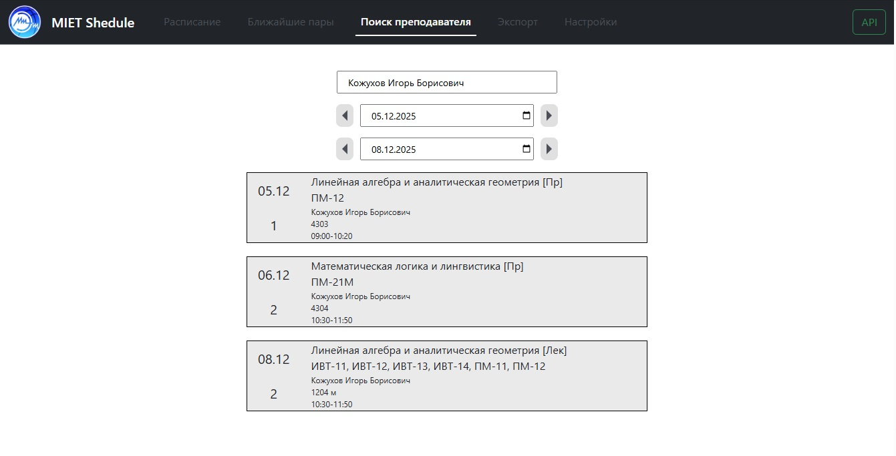

# MIET-Shedule

### Приложение для работы с расписанием МИЭТ

**Live version:** https://81.177.167.247:5173 

**API docs:** https://91.107.121.62:8080/swagger/index.html

Сервис интегрирован с открытым API МИЭТ для регулярного обновления расписания и предоставляет следующие функции:

- Расписание на заданную дату с учетом типа недели (первый/второй числитель/знаменатель)
- Поиск пар заданного преподавателя
- Отображение ближайших пар по каждому предмету
- Настройка типов отображаемых пар (лекции/семинары/лабораторные)
- Экспорт расписания в JSON

## Технологии

- **Backend:** ASP.NET Core, C#, PostgreSQL
- **Frontend:** ReactJS

**Официальное расписание МИЭТ:** https://www.miet.ru/schedule/
